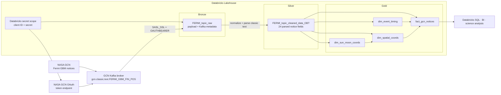

# NASA GCN Fermi Streaming Lakehouse

[](https://gcn.nasa.gov/)
[](https://kafka.apache.org/)
[](https://www.databricks.com/)
[](https://spark.apache.org/)
[](https://delta.io/)

A real-time astronomy data engineering pipeline that consumes **NASA General Coordinates Network (GCN)** notices from Kafka and transforms Fermi Gamma-ray Burst Monitor final-position messages into an analytics-ready lakehouse model on Databricks.

The project uses OAuth-authenticated Spark Structured Streaming, a Bronze–Silver–Gold architecture, text-to-column parsing, Kafka metadata retention, and a snowflake-style dimensional model for gamma-ray burst notice analysis.

## Architecture



See [Architecture](docs/ARCHITECTURE.md) for the ingestion sequence and processing lineage, [Data model](docs/DATA_MODEL.md) for the Gold schema, and [Notice parsing](docs/NOTICE_PARSING.md) for the Silver transformation.

## Pipeline highlights

- Connects directly to `kafka.gcn.nasa.gov:9092` over SASL/SSL.
- Uses OAuth bearer authentication with credentials stored in a Databricks secret scope.
- Subscribes to the classic-text Fermi GBM Final Position topic.
- Preserves Kafka topic, partition, offset, key, and timestamp for traceability.
- Normalizes non-breaking spaces and wrapped text lines in GCN notices.
- Consolidates repeated `COMMENTS` fields before converting notices to a key/value map.
- Extracts 24 astronomy and notice attributes into a streaming Silver OBT.
- Builds one central fact and three dimensions, including a snowflaked Sun/Moon dimension.
- Declares informational primary and foreign key constraints with `RELY` for the Gold model.

## Data flow

1. Lakeflow retrieves the NASA GCN client ID and secret from the `nasa-gcn` Databricks secret scope.
2. Spark authenticates with the NASA OAuth token endpoint and subscribes to `gcn.classic.text.FERMI_GBM_FIN_POS`.
3. Bronze casts the Kafka key and value to strings while retaining broker metadata.
4. Silver normalizes the classic-text message, merges continuation lines, and consolidates duplicate comment keys.
5. `str_to_map` converts newline-separated `KEY: VALUE` content into a Spark map.
6. Twenty-four known notice fields are extracted and trimmed.
7. Gold derives hash-based surrogate keys, casts measurements, and publishes a fact/dimension model.

## Technology stack

| Capability | Technology | Role |
|---|---|---|
| Event source | NASA GCN | Publishes real-time astronomical transient notices |
| Transport | Apache Kafka | Delivers Fermi final-position messages |
| Authentication | OAuth 2.0 / SASL OAUTHBEARER | Authenticates the Kafka consumer |
| Secret management | Databricks secret scopes | Stores the NASA client credentials |
| Stream processing | Spark Structured Streaming | Consumes, parses, and transforms events |
| Pipeline framework | Lakeflow Declarative Pipelines / DLT | Defines streaming tables and lineage |
| Storage | Delta Lake | Persists Bronze, Silver, and Gold tables |
| Governance | Unity Catalog | Organizes catalog, schemas, tables, and constraints |
| Modeling | Fact and snowflake dimensions | Supports analytical querying |

## Medallion layers

### Bronze

`kafka_nasa_fermi_topic.bronze.FERMI_topic_raw` stores the source message and Kafka delivery metadata:

| Column | Description |
|---|---|
| `kafka_key` | Kafka message key cast to string |
| `kafka_value` | Raw GCN classic-text notice |
| `kafka_topic` | Source topic |
| `kafka_partition` | Kafka partition |
| `kafka_offset` | Offset within the partition |
| `kafka_timestamp` | Broker timestamp |

### Silver

`kafka_nasa_fermi_topic.silver.FERMI_topic_cleaned_data_OBT` contains Kafka metadata plus 24 parsed notice fields, including trigger and record identifiers, sky coordinates, timing, localization measurements, energy range, Sun/Moon context, URLs, and comments.

### Gold

| Table | Purpose |
|---|---|
| `fact_gcn_notices` | One analytical record per streamed notice with measurements and dimensional keys |
| `dim_event_timing` | Raw gamma-ray burst and notice time attributes |
| `dim_spatial_coords` | Equatorial, galactic, and ecliptic coordinate context |
| `dim_sun_moon_coords` | Solar/lunar positions and Moon illumination |

## Repository structure

```text
.
└── Nasa_kafka_FERMI_topic/
    ├── explorations/
    │   ├── Exploration_Data_Ingestion.py
    │   └── Exploration_Data_Cleaning.py
    ├── transformations/
    │   ├── bronze/Data_Ingestion.py
    │   ├── silver/Data_Cleaning.py
    │   └── gold/Fact_Dimesion_Modelling.py
    └── utilities/
        └── gold_schema_definitions.py
```

The exploration notebooks capture development and inspection logic. The transformation files define the deployable streaming pipeline, while the utility module centralizes Gold table schemas and constraints.

## Prerequisites

- A NASA GCN account and OAuth client credentials
- A Databricks workspace with Unity Catalog enabled
- Permission to create objects in the `kafka_nasa_fermi_topic` catalog
- A Lakeflow Declarative Pipeline-compatible compute environment
- Outbound access from Databricks to the NASA GCN Kafka and OAuth endpoints
- A Databricks secret scope named `nasa-gcn`

## Setup

### 1. Clone or import the repository

```bash
git clone https://github.com/AdarshDamarla-Git/Kafka-Databricks-Nasa.git
```

Import the project into a Databricks Git folder or deploy it with your preferred Databricks CI/CD workflow.

### 2. Create the Unity Catalog objects

```sql
CREATE CATALOG IF NOT EXISTS kafka_nasa_fermi_topic;
CREATE SCHEMA IF NOT EXISTS kafka_nasa_fermi_topic.bronze;
CREATE SCHEMA IF NOT EXISTS kafka_nasa_fermi_topic.silver;
CREATE SCHEMA IF NOT EXISTS kafka_nasa_fermi_topic.gold;
```

### 3. Configure NASA GCN credentials

Create a secret scope named `nasa-gcn` and add these keys:

```text
client-id
client-secret
```

The notebooks retrieve them with:

```python
dbutils.secrets.get(scope="nasa-gcn", key="client-id")
dbutils.secrets.get(scope="nasa-gcn", key="client-secret")
```

Do not place OAuth credentials directly in the repository.

### 4. Create the Lakeflow pipeline

Add these source files:

```text
Nasa_kafka_FERMI_topic/transformations/bronze/Data_Ingestion.py
Nasa_kafka_FERMI_topic/transformations/silver/Data_Cleaning.py
Nasa_kafka_FERMI_topic/transformations/gold/Fact_Dimesion_Modelling.py
```

Ensure the project root or `Nasa_kafka_FERMI_topic` directory is available on the Python import path so the Gold module can import `utilities.gold_schema_definitions`.

Start the pipeline in continuous mode for ongoing ingestion, or use triggered updates for controlled processing windows.

## Validate the pipeline

```sql
-- Latest raw Kafka messages
SELECT
  kafka_topic,
  kafka_partition,
  kafka_offset,
  kafka_timestamp,
  kafka_value
FROM kafka_nasa_fermi_topic.bronze.FERMI_topic_raw
ORDER BY kafka_timestamp DESC
LIMIT 10;

-- Parsed notice identifiers and coordinates
SELECT
  TRIGGER_NUM,
  RECORD_NUM,
  GRB_RA,
  GRB_DEC,
  GRB_ERROR,
  NOTICE_DATE
FROM kafka_nasa_fermi_topic.silver.FERMI_topic_cleaned_data_OBT
LIMIT 20;

-- Gold notice facts with timing
SELECT
  f.trigger_num,
  f.record_num,
  t.grb_date_raw,
  t.grb_time_raw,
  f.grb_error_deg,
  f.loc_algorithm
FROM kafka_nasa_fermi_topic.gold.fact_gcn_notices AS f
LEFT JOIN kafka_nasa_fermi_topic.gold.dim_event_timing AS t
  ON f.timing_sk = t.timing_sk
ORDER BY f.kafka_timestamp DESC;
```

## Example analytics

### Localization accuracy by algorithm

```sql
SELECT
  loc_algorithm,
  COUNT(*) AS notices,
  ROUND(AVG(grb_error_deg), 4) AS avg_error_deg,
  MIN(grb_error_deg) AS min_error_deg,
  MAX(grb_error_deg) AS max_error_deg
FROM kafka_nasa_fermi_topic.gold.fact_gcn_notices
WHERE grb_error_deg IS NOT NULL
GROUP BY loc_algorithm
ORDER BY notices DESC;
```

### Recent burst coordinates

```sql
SELECT
  f.trigger_num,
  f.kafka_timestamp,
  s.right_ascension,
  s.declination,
  s.galactic_coords,
  f.grb_error_deg,
  f.location_url
FROM kafka_nasa_fermi_topic.gold.fact_gcn_notices AS f
JOIN kafka_nasa_fermi_topic.gold.dim_spatial_coords AS s
  ON f.spatial_sk = s.spatial_sk
ORDER BY f.kafka_timestamp DESC
LIMIT 50;
```

## Operational behavior

- `startingOffsets = earliest` requests the earliest offsets available for a new query/checkpoint.
- `failOnDataLoss = false` allows processing to continue if offsets are no longer available; monitor for skipped data.
- Kafka metadata enables partition/offset-level lineage and duplicate investigations.
- Dimension streams use `dropDuplicates` on their hash surrogate keys.
- Unity Catalog constraints declared with `RELY` communicate relationships but are not enforced like transactional foreign keys.

## Recommended production improvements

- Add pipeline expectations for required trigger IDs, valid Kafka metadata, parse success, and numeric ranges.
- Persist or quarantine the normalized notice text and malformed messages for troubleshooting.
- Parse dates, times, angles, coordinates, and illumination into typed analytical columns.
- Use a collision-resistant deterministic key such as `xxhash64` or a cryptographic hash if surrogate-key collision risk must be minimized.
- Add observability for consumer lag, offset gaps, parse-null rates, late data, and pipeline event-log failures.
- Standardize on `pyspark.pipelines` or document the required runtime for the legacy `dlt` Gold module.
- Add a Databricks Asset Bundle, environment variables, automated tests, and CI/CD.

## Documentation

- [Architecture and streaming flow](docs/ARCHITECTURE.md)
- [Gold data model](docs/DATA_MODEL.md)
- [Classic-text notice parsing](docs/NOTICE_PARSING.md)
- [Deployment and operations](docs/DEPLOYMENT.md)
- [Portfolio-ready project summary](docs/PROJECT_SHOWCASE.md)

## Author

**Adarsh Damarla** · [GitHub](https://github.com/AdarshDamarla-Git)

## License

No project-level license is currently included. Add one before permitting reuse or redistribution.
