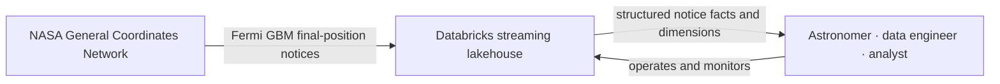
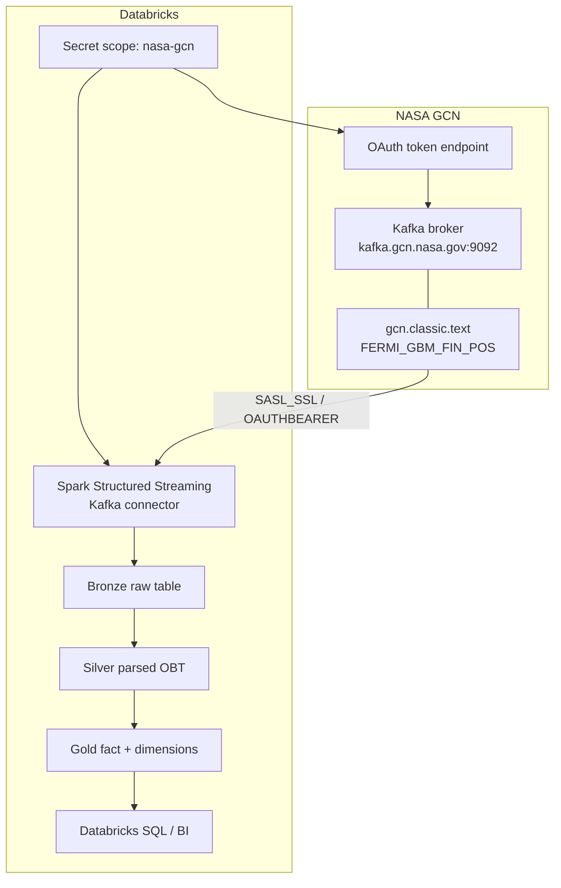
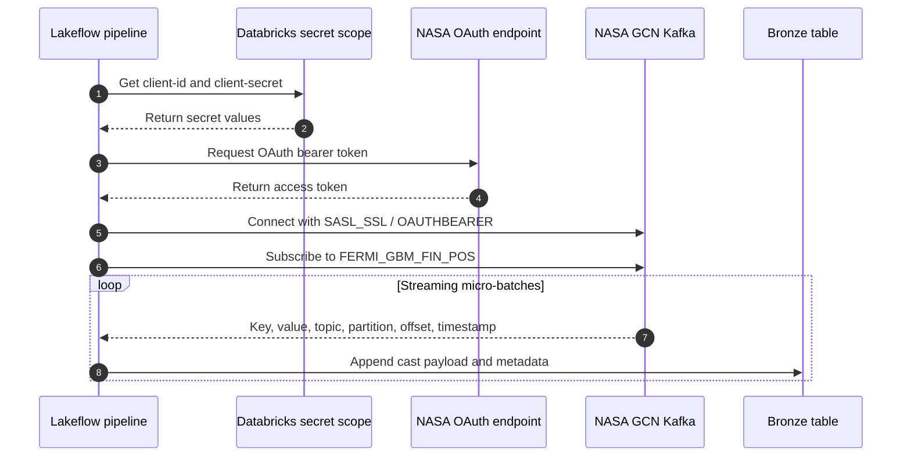
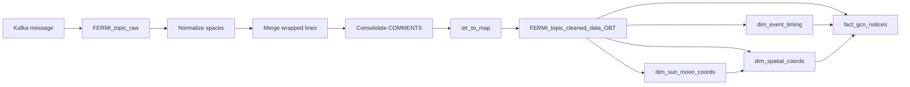

# Architecture

## System context

## Component architecture

## Authentication and ingestion sequence

## Transformation lineage

## Medallion responsibilities

| Layer | Responsibility | Recovery value |
|---|---|---|
| Bronze | Preserve source payload and Kafka delivery coordinates | Enables replay analysis and parser debugging |
| Silver | Convert semi-structured classic text into named columns | Provides a reusable, queryable notice contract |
| Gold | Cast measurements and organize analytical relationships | Supports efficient SQL and BI consumption |

## Streaming semantics

| Setting or behavior | Meaning |
|---|---|
| `startingOffsets=earliest` | A new checkpoint starts from the earliest offsets still retained by Kafka |
| `failOnDataLoss=false` | The stream continues when expected offsets are unavailable |
| Kafka metadata retained | Each fact can be traced to its topic, partition, and offset |
| Streaming dimensions | New coordinate/time combinations are incrementally added |
| `dropDuplicates` | Repeated dimension surrogate keys are suppressed using streaming state |

## Failure boundaries

- Secret lookup or OAuth failure prevents the Bronze stream from starting.
- Kafka connectivity or topic authorization failure blocks ingestion.
- Unexpected classic-text formatting can produce missing Silver fields without necessarily failing the stream.
- Numeric strings that do not begin with parseable numbers become null in Gold measurement columns.
- Missing or inconsistent dimension keys can yield unmatched analytical joins because `RELY` constraints are informational.
