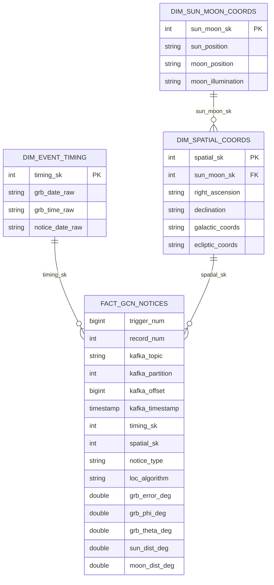

# Gold data model

## Snowflake schema



## Table grains

| Table | Intended grain | Key construction |
|---|---|---|
| `fact_gcn_notices` | One row per Kafka-delivered GCN notice | Natural trigger/record identifiers plus Kafka coordinates |
| `dim_event_timing` | One row per GRB date/time combination | `hash(GRB_DATE, GRB_TIME)` |
| `dim_spatial_coords` | One row per GRB coordinate combination | `hash(GRB_RA, GRB_DEC, GAL_COORDS)` |
| `dim_sun_moon_coords` | One row per Sun/Moon position combination | `hash(SUN_POSTN, MOON_POSTN)` |

## Fact measurements

| Gold column | Silver source | Conversion |
|---|---|---|
| `grb_error_deg` | `GRB_ERROR` | First space-delimited token cast to double |
| `grb_phi_deg` | `GRB_PHI` | First token cast to double |
| `grb_theta_deg` | `GRB_THETA` | First token cast to double |
| `sun_dist_deg` | `SUN_DIST` | First token cast to double |
| `moon_dist_deg` | `MOON_DIST` | First token cast to double |

The original raw strings remain available in Silver when units or formatting are needed for audit or reprocessing.

## Constraints

The schema module declares:

- Primary keys on all three dimensions
- A foreign key from the fact to the timing dimension
- A foreign key from the fact to the spatial dimension
- A foreign key from spatial coordinates to Sun/Moon coordinates

All are `RELY` constraints. They communicate trusted relationships to consumers and optimizers but do not validate or reject incoming records.

## Example queries

### Notice activity by Kafka partition

```sql
SELECT
  kafka_partition,
  COUNT(*) AS notices,
  MIN(kafka_offset) AS first_offset,
  MAX(kafka_offset) AS latest_offset,
  MAX(kafka_timestamp) AS latest_event
FROM kafka_nasa_fermi_topic.gold.fact_gcn_notices
GROUP BY kafka_partition
ORDER BY kafka_partition;
```

### Burst coordinates with solar/lunar context

```sql
SELECT
  f.trigger_num,
  f.kafka_timestamp,
  s.right_ascension,
  s.declination,
  s.galactic_coords,
  sm.sun_position,
  sm.moon_position,
  sm.moon_illumination,
  f.sun_dist_deg,
  f.moon_dist_deg
FROM kafka_nasa_fermi_topic.gold.fact_gcn_notices AS f
JOIN kafka_nasa_fermi_topic.gold.dim_spatial_coords AS s
  ON f.spatial_sk = s.spatial_sk
LEFT JOIN kafka_nasa_fermi_topic.gold.dim_sun_moon_coords AS sm
  ON s.sun_moon_sk = sm.sun_moon_sk
ORDER BY f.kafka_timestamp DESC;
```

## Modeling considerations

- Spark `hash` returns a 32-bit integer, so collisions are possible. A wider deterministic hash reduces collision risk.
- Timing values remain raw strings. Typed UTC timestamps and derived calendar columns would improve temporal analysis.
- Coordinate values remain strings. Parsing decimal degrees into numeric fields would enable range tests and sky-position calculations.
- A fact-level uniqueness expectation on topic, partition, and offset would strengthen delivery integrity.
