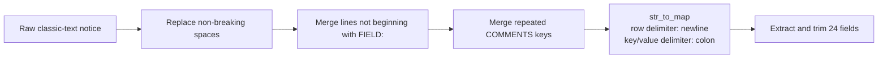

# Classic-text notice parsing

NASA GCN classic notices arrive as human-readable, newline-delimited text rather than JSON. Silver converts this format into columns without using a Python UDF, keeping the transformation inside Spark SQL expressions.

## Parsing flow



## Why each step exists

### Normalize spaces

Non-breaking spaces (`U+00A0`) can prevent consistent trimming and tokenization. They are replaced with ordinary spaces.

### Merge wrapped lines

The pattern `\n(?![A-Z_]+:)` identifies a newline not followed by an uppercase field label. Replacing it with a space joins continuation text to its preceding field.

### Consolidate comments

Some notices contain several consecutive `COMMENTS:` lines. A map cannot safely represent duplicate keys, so the pipeline repeatedly removes subsequent labels and joins their text. Five passes support up to 32 consecutive comment lines.

### Convert to a map

After normalization, each remaining line follows `KEY: VALUE`. `str_to_map(single_line_text, '\n', ':')` creates a map from which known keys can be selected.

## Extracted columns

| Group | Fields |
|---|---|
| Notice metadata | `TITLE`, `NOTICE_DATE`, `NOTICE_TYPE`, `RECORD_NUM`, `TRIGGER_NUM` |
| Burst coordinates | `GRB_RA`, `GRB_DEC`, `GRB_ERROR`, `GAL_COORDS`, `ECL_COORDS` |
| Burst timing | `GRB_DATE`, `GRB_TIME` |
| Instrument/localization | `GRB_PHI`, `GRB_THETA`, `E_RANGE`, `LOC_ALGORITHM` |
| Solar/lunar context | `SUN_POSTN`, `SUN_DIST`, `MOON_POSTN`, `MOON_DIST`, `MOON_ILLUM` |
| Resources | `LC_URL`, `LOC_URL`, `COMMENTS` |

Kafka metadata is retained beside all extracted fields.

## Edge cases to monitor

- New field labels containing digits or lowercase characters may not match the continuation-line expression.
- A value containing a colon relies on `str_to_map` behavior and can produce parsing ambiguity.
- More than 32 consecutive comment lines exceed the current bounded merge loop.
- Unknown fields are present in the temporary map but are not selected into Silver.
- Malformed messages can produce many null columns without raising a pipeline error.

## Recommended quality metrics

```sql
SELECT
  COUNT(*) AS total_notices,
  SUM(CASE WHEN TRIGGER_NUM IS NULL THEN 1 ELSE 0 END) AS missing_trigger,
  SUM(CASE WHEN GRB_RA IS NULL OR GRB_DEC IS NULL THEN 1 ELSE 0 END) AS missing_position,
  SUM(CASE WHEN NOTICE_DATE IS NULL THEN 1 ELSE 0 END) AS missing_notice_date
FROM kafka_nasa_fermi_topic.silver.FERMI_topic_cleaned_data_OBT;
```

For production, retain `single_line_text`, add a rescued/unknown-fields map, and route severely malformed notices to a quarantine table.
